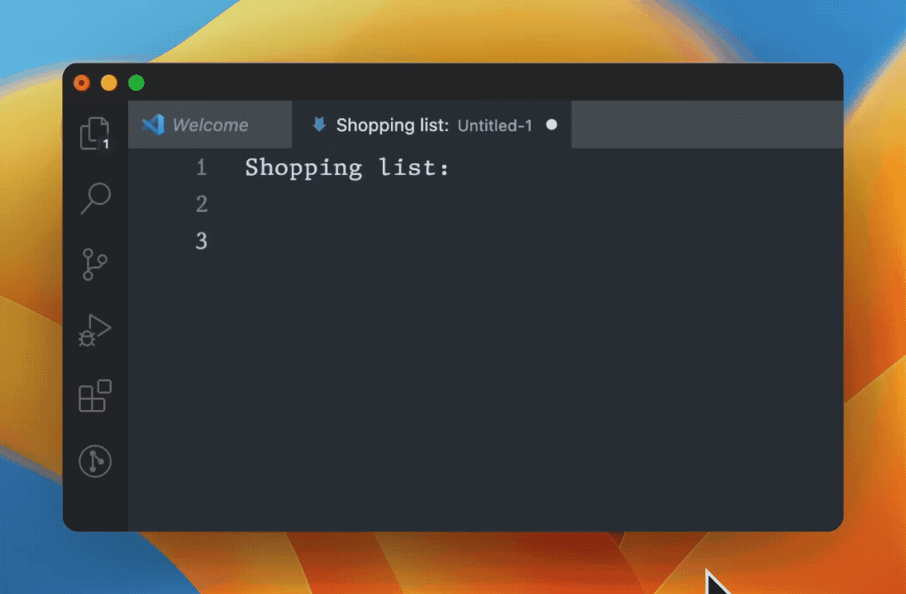

# Markdown Checkmarks

This Visual Studio Code extension allows you to easily toggle between `-`, `- [ ]`, and `- [x]` at the beginning of a line in Markdown and plain text files using a keyboard shortcut for managing checklists in Markdown.

## Features

- Quickly toggle between plain list items, unchecked task items, and checked task items in Markdown and plain text files.
- The extension activates automatically when working with Markdown or plain text files.

## Usage

Place the cursor on the line(s) you want to toggle, or select multiple lines, and then use the keyboard shortcut:

- **Shift+Enter**

It will toggle between `-`, `- [ ]`, and `- [x]` at the beginning of the selected lines.

## Installation

You can install the extension through the [Visual Studio Code Marketplace](https://marketplace.visualstudio.com/items?itemName=GencoCocoaCorp.markdowncheckmarks) or by following the instructions to package and [install it locally](https://code.visualstudio.com/api/working-with-extensions/publishing-extension).

## Contributing

Feel free to open issues or submit pull requests for any bugs or feature requests.

## License

[MIT](LICENSE)
